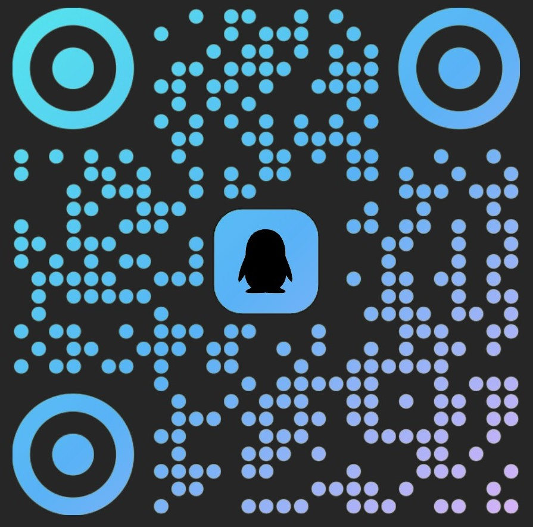

# GuGuGaGa War

<p align="left">
  <strong>Language:</strong> <a href="README.md">中文</a> ｜ English
</p>

**GuGuGaGa War** is a cute Q-style real-time strategy battle game built with the Godot 4 engine. You command a squad of adorable yet fierce little "GuGuGa" troops and clash against the AI or a friend on a castle-siege battlefield. The game blends campaign progression, free skirmishes, local two-player duels, and Roguelike runs, wrapped in systems like a unit codex, achievements, and anomaly events.

---

If you enjoy the game or find this project helpful, feel free to buy me a cup of milk tea!

<p align="center">
  
  
</p>

---

## Contents

- [Features](#features)
- [Game Modes](#game-modes)
- [Unit Roster](#unit-roster)
- [How to Play](#how-to-play)
- [Run Locally](#run-locally)
- [Export & Package](#export--package)
- [Project Structure](#project-structure)
- [License & Credits](#license--credits)
- [Contact / Community](#contact--community)

## Features

- **Q-style medieval hand-drawn art**: a fairy-tale adventure look with wood, parchment, and brick castles — bold outlines and warm grey tones, cute yet hardcore.
- **Multiple modes**: single-player campaign, free "total war" skirmishes, local two-player duels, and Roguelike runs.
- **24 units + heroes**: five factions (GuGuGa / Doro / Phoebe / Nuonuo / Hero) each with their own flavor, unlocked progressively via levels, war merits, and stars.
- **Deep tactical systems**: circular/elliptical attack ranges, status effects (bleed / poison / stun / slow / knockback / frost / erosion), shield & magic damage, and anomaly invasion events.
- **Achievements & codex**: a built-in achievement system (including hidden ones) and a read-only unit encyclopedia.
- **Multilingual**: Simplified Chinese, English, English (UK), 한국어, 日本語, ไทย, Français, Italiano and more.
- **Cross-platform**: Windows desktop export and Android packaging, with touch-based troop placement on Android.

## Game Modes

| Mode | Description |
|------|-------------|
| **Campaign** | Push through 10 levels across three factions. Difficulty: Normal / Hard / Hell. First clears grant war merits to unlock more units. |
| **Total War (single-player)** | Pick Easy / Normal / Hard and battle the AI in real time; the AI adapts its composition based on counters and battlefield state. |
| **Two-Player** | Local same-screen PvP with campaign and AI disabled — pure player vs player. |
| **Roguelike** | Build a composition in the map hub and chain through runs; win for a dedicated screen, lose and regroup to try again. |

> Difficulty semantics: main-menu free mode 0=Easy / 1=Normal / 2=Hard; campaign mode 0=Normal / 1=Hard / 2=Hell. AI strategy and achievement checks are routed per entry.

## Unit Roster

The game has **24 permanent units** and **2 hero units**, plus special units that only appear in dev tools / anomaly events. Unlock paths:

- **Starter 5**: G1 / G2 / G3 / D1 / D3 (available from the start)
- **Level unlocks 10**: L1→G4 … L10→N4 (unlocked as the campaign progresses)
- **War-merit unlocks 7**: D2 / G5 / D5 / F4 / N5 / G6 / D6 (spend the 1150 merits earned from first clears)
- **Star unlocks 2**: Hero1 Aimis / Hero2 Doro Warrior (20 stars each)
- **Hero units**: `Hero`-prefixed units are excluded from enemy AI / total-war / roguelike enemy pools; Hero2 is additionally gated behind the hidden achievement "For Orange!".

Faction SFX prefixes: Doro→D, GuGuGa→G, Phoebe→F, Nuonuo→N (Nuonuo is N, not F).

## How to Play

- **Main menu**: click a button to enter the corresponding mode; the bottom-right has links to the original creator's Bilibili space and the official QQ group.
- **Placement / targeting**: select a unit then place it; units auto-acquire targets and attack within range. Ranged units have an enter/exit hysteresis band to avoid jitter.
- **Debug console**: in dev mode (toggle with F11) a "Console" button appears on the main menu to live-tune every unit's in-battle sprite size.
- **Shortcuts**: F12 (dev mode) toggles the in-battle top button bar.

## Run Locally

Requirements:

- **Godot 4.7.x** (developed on Godot 4.7.1)
- Desktop: Windows / Linux / macOS all run the editor

Steps:

1. Clone the repo: `git clone <repo-url>`
2. Open the project root (the folder containing `project.godot`) with Godot 4.7.
3. Press <kbd>F5</kbd> in the editor to run, or click "Run Project" after importing.

## Export & Package

Two export presets are bundled (see `export_presets.cfg`):

- **Windows Desktop**: exports `GuGuGaGa War.exe` with the app and console-wrapper icons configured.
- **Android**: exports `Android/GuGuGaGaWar.apk` with launcher / adaptive / splash icons configured (package `com.gugugaga.war`).

Before exporting, set the platform templates in Godot's "Project → Export" dialog; Android also needs a signing keystore.

## Project Structure

```
GuGuGaGaWar/
├── addons/            # Plugins (gdUnit4 test framework, Godot MCP)
├── assets/            # Art, audio, fonts, localization
├── autoload/          # Global singletons (GameManager / Economy / Campaign / Achievements …)
├── data/              # Unit config and other data JSON
├── resources/         # Godot resource files (sprite sheets / materials / animations)
├── scenes/            # Scenes (ui / battle / units / main …)
├── scripts/           # Runtime GDScript modules (AI / combat / pool / roguelike / utilities)
├── project.godot      # Engine config
├── export_presets.cfg # Export presets
├── default_bus_layout.tres # Default audio bus layout
├── LICENSE            # MIT
├── README.md          # Chinese README
└── README_EN.md       # English README
```

## License & Credits

This project is open source under the **MIT License** — see [LICENSE](LICENSE).

- Original game & art design: [@阿白与阿银 (A Bai Yu A Yin)](https://space.bilibili.com/382838394)
- Special thanks to the Godot engine community and everyone who contributed suggestions and assets.

## Contact / Community

<p>
  <strong>Bilibili:</strong>
  <a href="https://space.bilibili.com/382838394">@阿白与阿银 (A Bai Yu A Yin)</a>
  
</p>

<p>
  <strong>Official QQ Group:</strong>
  939936934 (<a href="https://qm.qq.com/q/H0BklLFTEK">join</a>)
  
</p>

If you hit any issues while playing or modding, come join the community and chat with us!
